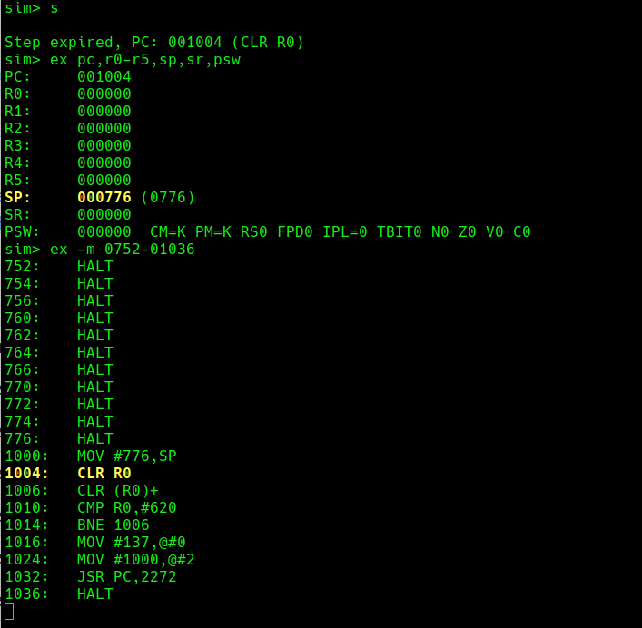
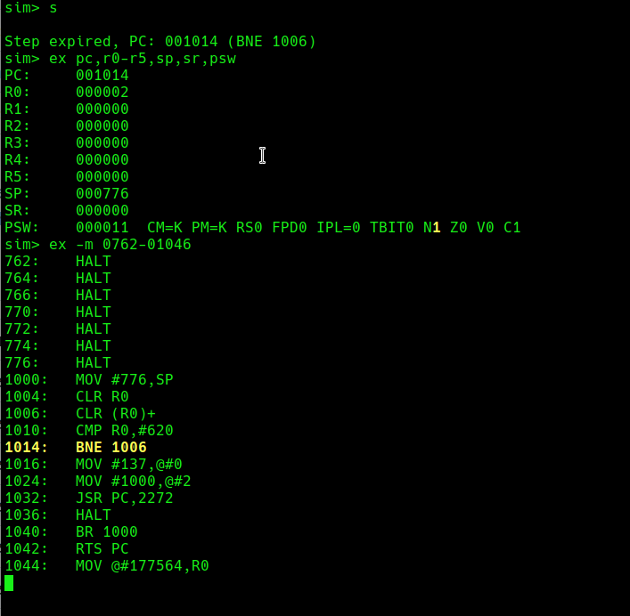
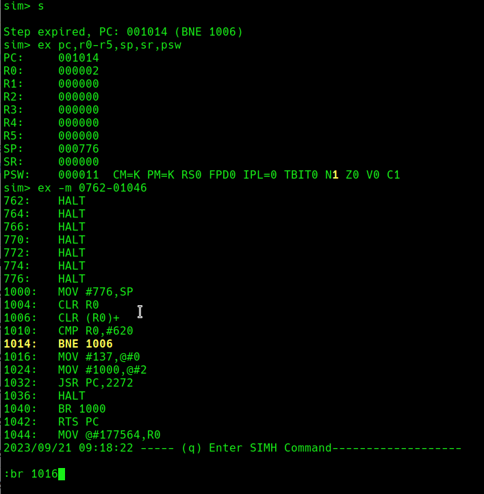

# pdp11-debug

This command wraps simh pdp11 process and allows to have a more user friendly debugging of
PDP11 code.
Features are:
* Single step execution by just entering character 's' 
* Automated listing of all registers after step execution (PC,R0-R5,SP,SR,PSW)
* Automated display of code line window around the currently executed command (around PC position)
* Automated highlighting of the current executed command, of changes in registers and of changes in PSW
* Automated output of value changes in registers 
* Arbitrary command input to SIMH by typing ':', followed by desired command line
* Command line parameters for deposit file to load and start address for execution
* Quit with 'q'

```cgo
pdp11-debug --depositFile ./test-libgdd.deposit

# or directly from go sources
go run . --depositFile ./test-libgdd.deposit
```

Next screen shows execution of some example code. A single step was executed (command 's').
At the top, the registers PC,R0-R5 etc. are listed. There was a change in register SP since
last executed command, this is highlighted. Also the value change is listed.

Below that, commands are displayed around the currently executed command. Next executed
command is highlighted.


Last executed command (CMP R0,#620) changed the N bit in PSW. This is highlighted.


With ':' command, it is possible to enter a SIMH command anytime. Here, I entered 'br 1016'.



## Related
ASCII terminal codes https://gist.github.com/fnky/458719343aabd01cfb17a3a4f7296797#erase-functions
